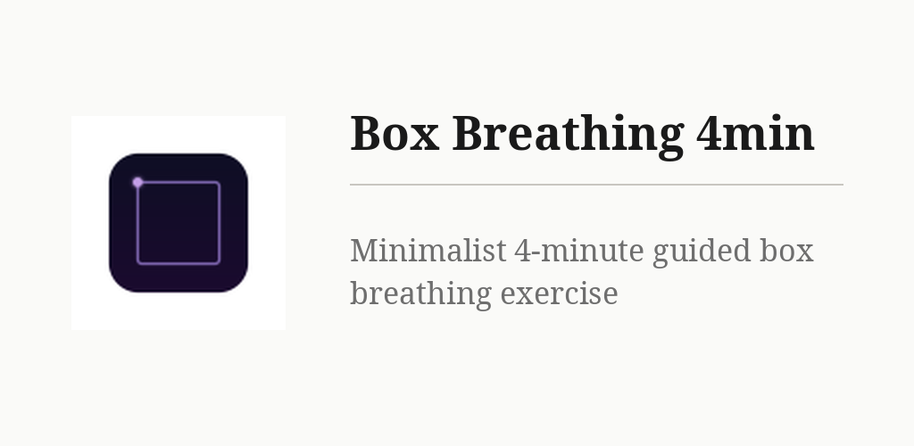

# Box Breathing 4min

**FR** — Appli de respiration carrée calme et sans distraction. Suivez le point lumineux autour d'un carré : inspirez, retenez, expirez, retenez. La séance de 4 minutes commence sur un rythme de 3 secondes et passe doucement à 4 secondes à mi-parcours. Instructions bilingues (français / anglais), écran maintenu allumé, aucun compte, aucune pub, aucun pistage, aucune connexion requise.

**EN** — A calm, distraction-free box-breathing app: follow the glowing dot around a square (breathe in, hold, breathe out, hold). The 4-minute session opens at a 3-second rhythm and eases to 4 seconds halfway through. Bilingual prompts, screen stays awake, no accounts, no ads, no tracking, fully offline.

## Build

Expo / React Native (managed workflow, expo-router).

```
npm install
npx expo prebuild --platform android --clean
cd android && ./gradlew assembleRelease
```

`prebuild --clean` regenerates `android/` and therefore **discards the build
settings that keep the APK at 25 MB** — reapply them from the *Compilation*
section below before running `assembleRelease`.

For iOS, see `DEPLOY.md` for the Codemagic pipeline.

## Install

Install the generated APK on an Android device, or grab it from the author's F-Droid repository.

## Crédits / Credits

© 2026 Pierre Gallaz. Développé avec [Claude Code](https://claude.com/claude-code) (Anthropic).
Licence GPL-3.0-only, voir `LICENSE`.

© 2026 Pierre Gallaz. Developed with [Claude Code](https://claude.com/claude-code) (Anthropic).
GPL-3.0-only licence, see `LICENSE`.

## Compilation

Le dossier `android/` est régénéré par Expo (`npx expo prebuild`) et n'est pas
versionné : les réglages ci-dessous sont à réappliquer après chaque régénération.

1. `android/local.properties` — indispensable, sinon Gradle ne trouve pas le SDK :

       sdk.dir=/chemin/vers/Android/Sdk

2. `android/gradle.properties` — APK de 77 Mo à 25 Mo :

       reactNativeArchitectures=arm64-v8a
       android.enableMinifyInReleaseBuilds=true
       android.enableShrinkResourcesInReleaseBuilds=true

   La première ligne ne garde que les bibliothèques 64 bits ; les trois autres
   familles de processeurs pesaient 48 Mo. Les deux suivantes réduisent le code.
   Conséquence : les téléphones 32 bits et les émulateurs x86 ne peuvent plus
   installer l'APK. Pour tester sur émulateur, ajouter `,x86_64` à la première
   ligne le temps de l'essai.

3. `app.json` reste la source de vérité pour la version (`version` et
   `android.versionCode`), puisque `android/app/build.gradle` est régénéré.

       cd android && ./gradlew assembleRelease
